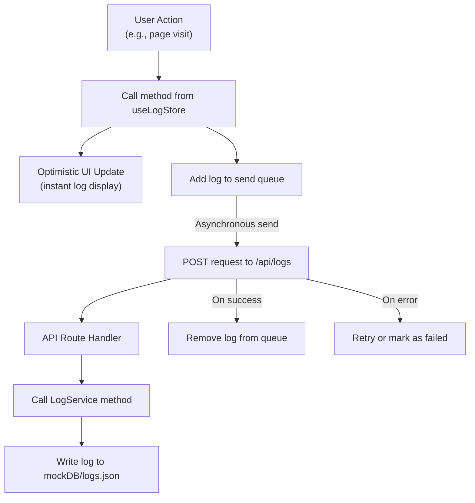

<p align="center">
  
</p>

<p align="center">
  <a href="https://f8vzqd-3000.csb.app/signup">🟢 نمایش نسخه‌ی دمو</a>
</p>

<br />

# پنل مدیریت داریا

این یک پروژه پنل مدیریت است که با استفاده از [Next.js](https://nextjs.org) توسعه داده شده است. این پنل شامل ویژگی‌هایی مانند احراز هویت کاربران، نمایش لیست کاربران، و یک سیستم جامع برای ثبت و نمایش لاگ‌های فعالیت کاربران است.

## 🚀 راه اندازی پروژه

برای اجرای پروژه به صورت محلی، دستور زیر را اجرا کنید:

```bash
npm run dev
```

سپس مرورگر خود را باز کرده و به آدرس [http://localhost:3000](http://localhost:3000) بروید.

## 🧪 اجرای تست‌ها

این پروژه شامل مجموعه‌ای از تست‌های unit و integration است که با استفاده از Jest و React Testing Library نوشته شده‌اند.

### دستورات تست

```bash
# اجرای تمام تست‌ها
npm test

# اجرای تست‌ها در حالت watch (نظارت بر تغییرات)
npm run test:watch

# اجرای تست‌ها با نمایش پوشش کد (coverage)
npm run test:coverage
```

### انواع تست‌های موجود

- **تست‌های کامپوننت**: تست عملکرد کامپوننت‌های React مانند `LogRow`، `VirtualTable`، و `QueryProvider`
- **تست‌های هوک**: تست منطق هوک‌های سفارشی مانند `useLogs` و `usePageVisitLogger`
- **تست‌های استور**: تست مدیریت استیت در `logStore` با Zustand
- **تست‌های سرویس**: تست منطق کسب‌وکار در `logs.service`
- **تست‌های API**: تست endpoint های API مانند `/api/logs`
- **تست‌های integration**: تست جریان کامل لاگ‌نویسی از ابتدا تا انتها

## ⚡ بهینه‌سازی‌های به‌کارگیری شده

این پروژه از تکنیک‌های مختلف بهینه‌سازی برای بهبود عملکرد و تجربه کاربری استفاده می‌کند:

### بهینه‌سازی‌های Frontend

- **Virtual Scrolling**: استفاده از `react-window` برای نمایش بهینه لیست‌های بزرگ (کاربران و لاگ‌ها) بدون کاهش عملکرد
- **Optimistic UI Updates**: به‌روزرسانی فوری رابط کاربری قبل از دریافت پاسخ سرور برای تجربه کاربری بهتر
- **State Management بهینه**:
  - استفاده از Zustand با Immer برای به‌روزرسانی‌های immutable و کارآمد
  - جداسازی state های مختلف (auth، logs، users) در استورهای مجزا
- **Caching هوشمند**: استفاده از TanStack Query برای کش کردن داده‌های سرور و کاهش درخواست‌های غیرضروری
- **Code Splitting**: استفاده از ساختار App Router در Next.js برای بارگذاری تنها کدهای مورد نیاز هر صفحه

### بهینه‌سازی‌های Performance

- **Turbopack**: استفاده از Turbopack در Next.js 15 برای build و development سریع‌تر
- **Pagination**: پیاده‌سازی صفحه‌بندی در API برای کاهش حجم داده‌های منتقل شده
- **Event Debouncing**: بهینه‌سازی رویدادهای window resize برای جلوگیری از اجرای مکرر
- **Lazy Loading**: بارگذاری تنها کامپوننت‌های مورد نیاز در هر صفحه

### بهینه‌سازی‌های UX

- **Queue System**: سیستم صف برای اطمینان از ارسال موفق تمام لاگ‌ها حتی در شرایط قطعی اینترنت
- **Persistent Storage**: ذخیره‌سازی لاگ‌های در انتظار ارسال در localStorage
- **Error Handling**: مدیریت خطاها با قابلیت تلاش مجدد خودکار
- **Loading States**: نمایش وضعیت‌های بارگذاری مناسب برای بهبود درک کاربر از وضعیت سیستم

## 🛠️ تکنولوژی‌های استفاده شده

این پروژه با استفاده از جدیدترین تکنولوژی‌های وب توسعه داده شده است:

- **فریم‌ورک**: [Next.js 15](https://nextjs.org/) (با App Router و Turbopack)
- **زبان برنامه‌نویسی**: [TypeScript](https://www.typescriptlang.org/)
- **کتابخانه UI**: [React 19](https://react.dev/)
- **مدیریت استیت (State Management)**:
  - [Zustand](https://github.com/pmndrs/zustand) برای مدیریت استیت گلوبال (مانند اطلاعات کاربر و لاگ‌ها).
  - [TanStack Query (React Query)](https://tanstack.com/query/latest) برای مدیریت استیت سرور، کشینگ و همگام‌سازی داده‌ها.
- **استایل‌دهی**: [Tailwind CSS](https://tailwindcss.com/) برای سرعت بیشتر توسعه
- **تست‌نویسی**: [Jest](https://jestjs.io/) و [React Testing Library](https://testing-library.com/) برای تست‌های unit و integration.
- **فرم**: [React Hook Form](https://react-hook-form.com/) برای مدیریت فرم‌ها و اعتبارسنجی.

## 📁 ساختار پروژه

پروژه از ساختار App Router در Next.js پیروی می‌کند:

- `src/app`: شامل تمام صفحات و روت‌های API پروژه است.
  - `(auth)`: گروهی برای صفحات احراز هویت (ورود و ثبت‌نام).
  - `(dashboard)`: گروهی برای صفحات اصلی پنل که نیاز به احراز هویت دارند (کاربران و لاگ‌ها).
  - `api`: شامل تمام Endpoint های API سمت سرور.
- `src/components`: شامل کامپوننت‌های قابل استفاده مجدد در سراسر پروژه.
- `src/services`: منطق ارتباط با API و فایل سیستم در این بخش قرار دارد.
- `src/stores`: شامل استورهای Zustand برای مدیریت استیت گلوبال.
- `src/hooks`: شامل هوک‌های سفارشی برای استفاده در کامپوننت‌ها.
- `mockDB`: یک پایگاه داده شبیه‌سازی شده با استفاده از فایل‌های JSON.

## 🔐 سیستم احراز هویت و امنیت

این پروژه از یک سیستم احراز هویت با استفاده از middleware و کوکی‌ها برای محافظت از صفحات محرمانه استفاده می‌کند:

### ویژگی‌های امنیتی

- **Middleware Protection**: استفاده از `middleware.ts` در Next.js برای بررسی وضعیت احراز هویت کاربران قبل از دسترسی به صفحات محافظت شده
- **Cookie-based Authentication**: ذخیره‌سازی اطلاعات احراز هویت در کوکی‌های امن مرورگر
- **Route Protection**: محافظت خودکار از تمام صفحات داخل گروه `(dashboard)` در برابر دسترسی کاربران غیرمجاز
- **Automatic Redirection**: هدایت خودکار کاربران غیرمجاز به صفحه ورود

### جریان احراز هویت

1. **ثبت‌نام/ورود**: کاربر اطلاعات خود را در فرم‌های مربوطه وارد می‌کند
2. **اعتبارسنجی**: سرور اطلاعات را با داده‌های موجود در `mockDB/users.json` مقایسه می‌کند
3. **تنظیم کوکی**: در صورت موفقیت، یک کوکی احراز هویت تنظیم می‌شود
4. **محافظت middleware**: تمام درخواست‌های بعدی توسط middleware بررسی شده و دسترسی کنترل می‌شود
5. **مدیریت وضعیت**: اطلاعات کاربر در `authStore` ذخیره و مدیریت می‌شود

## 📝 سیستم لاگ‌نویسی (Logging System)

یکی از ویژگی‌های کلیدی این پنل، سیستم ثبت لاگ فعالیت کاربران است. این سیستم به صورت بهینه و قابل اطمینان طراحی شده تا هیچ لاگی از دست نرود، حتی در شرایطی که ارتباط با سرور برقرار نباشد.

### معماری سیستم لاگ

معماری این سیستم بر اساس یک رویکرد **Optimistic UI** و **صف (Queue)** طراحی شده است. زمانی که یک فعالیت (مانند بازدید از صفحه) رخ می‌دهد، لاگ آن بلافاصله در UI نمایش داده می‌شود و به صورت همزمان در یک صف برای ارسال به سرور قرار می‌گیرد. این کار تجربه کاربری بهتری را فراهم می‌کند.

در زیر، دیاگرام جریان داده در سیستم لاگ‌نویسی نمایش داده شده است:



### جریان داده (Data Flow)

1.  **شروع رویداد**: کاربر یک عملیات انجام می‌دهد (مثلاً از صفحه‌ی کاربران بازدید می‌کند).
2.  **فراخوانی استور**: کامپوننت مربوطه، متد `logPageVisit` یا `addOptimisticLog` را از استور `useLogStore` (که با Zustand ساخته شده) فراخوانی می‌کند.
3.  **آپدیت Optimistic**: لاگ جدید بلافاصله به آرایه‌ی `recentLogs` در استور اضافه می‌شود. این باعث می‌شود که UI به سرعت و بدون انتظار برای پاسخ سرور، به‌روزرسانی شود.
4.  **اضافه شدن به صف**: همان لاگ به آرایه‌ی `queuedLogs` اضافه می‌شود و وضعیت آن `pending` تعیین می‌شود. این صف مسئولیت ارسال مطمئن لاگ‌ها به سرور را بر عهده دارد.
5.  **ارسال به سرور**: یک تابع `async` بلافاصله شروع به کار می‌کند و لاگ را از طریق یک درخواست `POST` به `api/logs/` ارسال می‌کند. وضعیت لاگ در صف به `sending` تغییر می‌کند.
6.  **پردازش در سرور**: روت API در `src/app/api/logs/route.ts` درخواست را دریافت کرده و با استفاده از `logs.service.ts`، لاگ جدید را در فایل `mockDB/logs.json` می‌نویسد.
7.  **نتیجه عملیات**:
    - **موفقیت**: در صورت دریافت پاسخ موفق از سرور، لاگ از صف `queuedLogs` حذف می‌شود.
    - **شکست**: در صورت بروز خطا، وضعیت لاگ در صف به `failed` تغییر می‌کند تا بعداً برای ارسال مجدد تلاش شود یا به کاربر اطلاع داده شود.

این معماری تضمین می‌کند که تجربه کاربری سریع و روان باشد و هیچ داده‌ای از دست نرود.

## 📄 صفحات اصلی

- **صفحه ورود (Login)**: فرم ورود کاربران.
- **صفحه ثبت نام (Signup)**: فرم ثبت نام کاربران جدید.
- **صفحه کاربران (Users)**: نمایش لیست تمام کاربران.
- **صفحه پروفایل کاربر (User Profile)**: نمایش جزئیات یک کاربر خاص.
- **صفحه لاگ‌ها (Logs)**: نمایش تمام لاگ‌های ثبت شده در سیستم با استفاده از یک جدول مجازی (Virtual Table) برای عملکرد بهتر در هنگام نمایش تعداد زیادی لاگ.

## ⚠️ محدودیت‌های عمدی

این پروژه به عنوان یک نمونه آموزشی و نمایشی طراحی شده است و از فایل‌های JSON ساده در پوشه `mockDB` برای ذخیره‌سازی داده‌ها استفاده می‌کند:

- **`mockDB/logs.json`**: تمام لاگ‌های فعالیت کاربران در این فایل ذخیره می‌شوند.
- **`mockDB/users.json`**: اطلاعات کاربران شامل نام کاربری، رمز عبور و سایر جزئیات در این فایل نگهداری می‌شوند.

این رویکرد برای محیط‌های تولیدی (Production) مناسب نیست و باید با یک پایگاه داده واقعی مانند PostgreSQL، MongoDB یا MySQL جایگزین شود.
